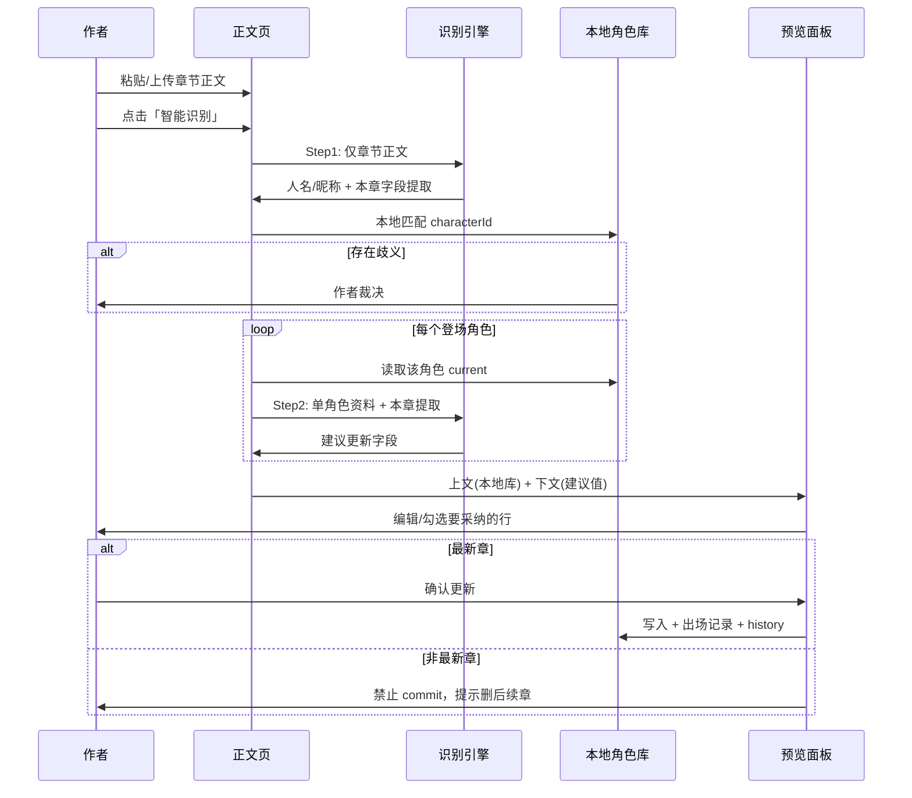

# 小说创作助手 v3

> 面向「边写边完善」的长篇网文作者，以**防吃书**为核心价值，提供地图、角色关系网、正文识别与可自定义设定模块。

**一句话定位：** 帮网文作者在边写边改的过程中，自动维护「谁、在哪、什么境界、和谁什么关系」，减少吃书与设定冲突。

不是写作软件（不替代 Word/语雀），不是 AI 代写工具，而是**设定记忆层 + 智能校对层**。

---

## 目标用户

| 类型 | 描述 |
|------|------|
| **主要** | 连载长篇网文作者（玄幻、仙侠、都市异能等设定密集型题材）；习惯在外部编辑器写作，将章节**粘贴或上传**到本工具做设定维护；多线叙事、配角众多 |
| **次要** | 完结后修订的作者（批量导入全书做设定归档）；同人/群像作者（关系网可视化需求强） |
| **非目标** | 需要富文本排版、发布的作者；短篇、现实主义、设定极简的作品 |

---

## 设计原则

| 原则 | 要点 |
|------|------|
| **P1 · 作者主权** | AI 只**提取预览**，不**擅自**修改角色库，**不提供创作建议**；严格模式预览确认；同名由作者裁决 |
| **P2 · 防漏优于防错** | 识别宁可多提取候选，预览里由作者删减；地点、境界、别名等可追加列表；提醒「本章未处理的角色提及」 |
| **P3 · 边写边长** | 允许空项目启动；角色可只有名字；关系网随登场角色自动扩展 |
| **P4 · 最小干扰布局** | 正文三栏（极窄章节列表 \| 编辑 \| 预览）；左侧角色名列表常驻可折叠；少弹模态框 |
| **P5 · 模块即工具** | 设定页提供块编辑器、思维导图、表格等**工具**，不强制「正确的大纲格式」 |
| **P6 · 本地优先** | 数据默认本地、存储目录用户自选；识别 Step 1 仅发章节正文，Step 2 按角色逐人发该角色资料；用户自备文本 LLM API Key；支持导出备份 |

---

## 功能全景

```
小说创作助手 v3
├── 顶栏
│   ├── 存储目录选择（用户自选，全局）
│   └── 作品名 / 设置 / 导出
│
├── 首页（作品入口）
│   ├── 作品列表 / 新建
│   └── 进入作品 → 默认「正文」（非地图）
│
├── 全局壳层
│   ├── 最左：角色名列表 + 搜索（全书级，各页常驻可折叠）
│   └── 侧边栏：正文 | 地图 | 角色 | 设定
│
├── 正文（核心工作流）
│   ├── 左：章节切换（极简）
│   ├── 中：粘贴 / 上传正文（txt / docx / 番茄格式）
│   └── 右：识别预览（双栏 diff → 可内联编辑 → 严格确认更新）
│
├── 地图
│   ├── 左侧：世界选择 + 搜索查询
│   ├── 主区：文本 LLM 生成地图代码 → 沙箱渲染（真实地理关系）
│   └── 作者提示词驱动生成/更新（与正文识别独立）
│
├── 角色
│   ├── 球状关系网（默认单主角居中；群像可多中心）
│   ├── 点击节点 → 人物卡片 + 角色面板词条
│   └── 与角色名列表联动
│
└── 设定
    ├── 顶部：选择工具 → 添加模块
    ├── 内置四模板：大纲 / 力量体系 / 人设表 / 伏笔追踪（可空白）
    └── 下方：自定义标题 + 模块内容（富文本/清单/表格…）
```

### 核心工作流



### 用户故事（摘要）

| ID | 故事 | 关键验收 |
|----|------|----------|
| US-01 | 用提示词生成可交互地理地图 | LLM 生成 HTML/SVG 沙箱渲染；地点有方位邻接关系；悬停突出 |
| US-02 | 粘贴章节并识别角色变化 | Step 1 仅发正文提取；本地匹配角色库；Step 2 按人发单角色资料合并；同名阻断交由作者裁决 |
| US-03 | 预览确认并更新（仅最新章） | 双栏 diff 行级勾选；非最新章禁用 commit |
| US-04 | 球状关系网浏览 | 单主角/多中心；节点距离反映关系量化；点击卡片含面板词条 |
| US-05 | 全书角色名快速检索 | 模糊搜索、别名匹配；显示境界与最近出场章 |
| US-06 | 自定义设定模块 | 富文本/思维导图/表格/清单；四内置模板可空白 |
| US-07 | 章节管理（轻量） | 左栏 ≤ 56px 或 hover 展开；拖拽排序 |

完整验收标准见 [`md/01-product-overview.md`](./md/01-product-overview.md)。

### 功能优先级（MoSCoW）

**Must（MVP）**
- 作品 CRUD、用户自选存储目录
- 正文三栏 + LLM 两步严格识别 → 预览 → 仅最新章确认更新
- 球状关系网（单主角/多中心）
- 地图：世界选择 + LLM 生成代码沙箱渲染
- 设定页：富文本/清单 + 四内置模板
- .docx / txt / 番茄格式导入

**Could（第二期）** — 思维导图模块、设定冲突检测、地图 2D 示意图、别名追踪、导出设定 Bible、小程序端

**Won't（本期不做）** — 云端同步、AI 写正文、识别自动更新地图、宽松模式、语音输入

---

## 产品边界

- ❌ AI 续写、代写章节正文
- ❌ 发布到阅文/起点等平台
- ❌ 多人实时协同编辑（v1 不做，可预留导出）
- ❌ 替代专业思维导图软件的全部能力
- ❌ 自动判定剧情好坏或文风

---

## 成功指标

**定性：** 30 秒内找到某配角上次出场境界；预览能看清相对上一版多了/改了什么；关系网一眼看出主角与核心配角位置。

**定量（MVP 后）：** 单章识别→确认 < 3 分钟（5000 字）；500 角色搜索 < 200ms；设定冲突检测命中率可测。

---

## 术语表

| 术语 | 含义 |
|------|------|
| **作品（Project）** | 一部小说，包含地图、角色、章节、设定模块 |
| **角色库（Character Registry）** | 全书角色的权威数据源 |
| **识别（Recognition）** | 从正文片段提取角色/地点/境界等结构化信息 |
| **预览（Preview）** | 识别结果与角色库 diff，未写入前的暂存态 |
| **确认更新（Commit）** | 作者批准后写入角色库，并记录变更日志 |
| **设定模块（Setting Module）** | 作者在设定页自定义的一块内容（大纲块、思维导图块等） |
| **关系网（Relation Graph）** | 以主角为中心（或群像多中心）的角色关系可视化 |
| **角色面板（Character Panel）** | 每个角色独立的词条区（功法/技能、法宝/装备等） |

---

## 与竞品差异

| 产品类型 | 代表 | 差异点 |
|----------|------|--------|
| 写作软件 | Scrivener、语雀 | 不做排版发布，专注设定记忆 |
| 设定 wiki | Notion、World Anvil | 识别从正文自动填充，而非纯手工建库 |
| AI 写作 | Sudowrite | 不代写，只做提取与防吃书 |

---

## 文档结构

| 目录 | 用途 |
|------|------|
| **本 README** | 产品愿景、功能全景、设计原则（整合自 `md/00`、`md/01`） |
| [`md/`](./md/) | **计划说明** — 详细规格、数据模型、已确认决策 |
| [`impl/`](./impl/) | **计划实施** — 分步开发手册，按 Step 01→15 执行 |

### 计划说明（`md/`）

| 文档 | 内容 |
|------|------|
| [00-vision-and-principles.md](./md/00-vision-and-principles.md) | 与 README 同步的愿景与原则（详细版） |
| [01-product-overview.md](./md/01-product-overview.md) | 与 README 同步的功能全景（含完整用户故事验收） |
| [02-information-architecture.md](./md/02-information-architecture.md) | 导航结构、页面层级、全局布局 |
| [03-ui-layout-spec.md](./md/03-ui-layout-spec.md) | 各区域尺寸、交互、响应式规则 |
| [04-character-system.md](./md/04-character-system.md) | 角色模型、关系网、时间线 |
| [05-map-system.md](./md/05-map-system.md) | 地图 LLM 代码生成、沙箱渲染 |
| [06-text-recognition-pipeline.md](./md/06-text-recognition-pipeline.md) | 两步识别、预览、Commit 规范 |
| [07-settings-custom-modules.md](./md/07-settings-custom-modules.md) | 自定义模块、四内置模板 |
| [08-data-model.md](./md/08-data-model.md) | 实体关系、存储 |
| [09-tech-stack.md](./md/09-tech-stack.md) | 技术选型 |
| [10-mvp-roadmap.md](./md/10-mvp-roadmap.md) | 阶段里程碑 |
| [11-open-questions.md](./md/11-open-questions.md) | 已确认决策 |

### 计划实施（`impl/`）

从 **[impl/README.md](./impl/README.md)** 开始 → [00-实施总览](./impl/00-实施总览.md) → Step 01…15

---

## 当前状态

- [x] 产品规划文档（`md/`）
- [x] 开放问题确认
- [x] 分步实施说明（`impl/`）
- [x] Step 01 脚手架开发
- [x] Step 02 数据库与 Repository
- [x] Step 03 Electron 主进程与存储目录
- [x] Step 04 全局布局与路由
- [x] Step 05 正文与章节 CRUD
- [x] Step 06 LLM 客户端与设置页
- [x] Step 07 识别 Step1 角色名匹配
- [x] Step 08 识别 Step2 信息提取

## 下一步

打开 [`impl/step-01-monorepo脚手架.md`](./impl/step-01-monorepo脚手架.md) 继续开发。

---

## 安装与使用

本仓库分为两部分发布：

| 内容 | 位置 | 说明 |
|------|------|------|
| **源代码** | 本仓库 `main` 分支 | 完整 monorepo，可自行构建与二次开发 |
| **打包程序** | [GitHub Releases](https://github.com/OWNER/novel-assistant-v3/releases) | Windows 安装包（`.exe`），无需 Node 环境 |

> 将上表中的 `OWNER` 替换为你的 GitHub 用户名或组织名。

### 方式一：下载安装包（推荐普通用户）

1. 打开仓库 **Releases** 页面，下载最新版 `小说创作助手 v3 Setup x.x.x.exe`
2. 双击安装，按向导完成
3. 首次启动后，在 **设置** 中配置 LLM API Key（本软件不内置 Key，也不会上传到 GitHub）
4. 在顶栏选择 **存储目录**（作品数据保存在本地该目录）

### 方式二：从源码运行（开发者）

**环境要求：** Node.js ≥ 20、pnpm 9

```bash
# 克隆仓库
git clone https://github.com/OWNER/novel-assistant-v3.git
cd novel-assistant-v3

# 安装依赖
pnpm install

# 开发模式启动桌面端
pnpm dev
```

API Key 在应用内 **设置页** 填写并加密存于本机，**不要**写入 `.env` 后提交到 Git。

### 方式三：自行打包安装程序

```bash
pnpm install
pnpm --filter @novel-assistant/desktop build:installer
```

产物路径：`apps/desktop/dist/小说创作助手 v3 Setup 0.0.1.exe`（版本号以 `package.json` 为准）。

### 基本操作

1. **新建作品** → 首页创建作品并进入
2. **正文** → 粘贴或导入章节 → **智能识别** → 预览确认后更新角色库（仅最新章可确认）
3. **地图** → 填写地图提示词或添加地点节点 → **生成地图**（需已配置 API Key）
4. **角色** → 查看关系网与人物卡片
5. **设定** → 添加大纲、力量体系等自定义模块

### 发布到 GitHub（维护者）

**前置：** 安装 [GitHub CLI](https://cli.github.com/) 并登录（不会使用或上传你的 API Key）：

```bash
winget install GitHub.cli
gh auth login
```

**一键发布（推荐）：**

```powershell
# 在仓库根目录执行；自动提交、推送 main、构建安装包并创建 Release
.\scripts\publish-github.ps1 -Version 0.0.1
```

**手动步骤：**

```bash
# 1. 初始化并提交源码（首次）
git init
git add .
git commit -m "feat: initial open-source release"

# 2. 在 GitHub 创建空仓库 novel-assistant-v3，然后：
git remote add origin https://github.com/OWNER/novel-assistant-v3.git
git branch -M main
git push -u origin main

# 3. 打包并上传 Release
pnpm --filter @novel-assistant/desktop build:installer
gh release create v0.0.1 "apps/desktop/dist/小说创作助手 v3 Setup 0.0.1.exe" \
  --title "v0.0.1" \
  --notes "首个 Windows 安装包"
```

**安全提醒：** 切勿将 API Key、`.env`、本地数据库（`*.db`）提交到仓库；若曾误提交，请立即在 LLM 服务商处轮换 Key 并从 Git 历史中清除敏感文件。
