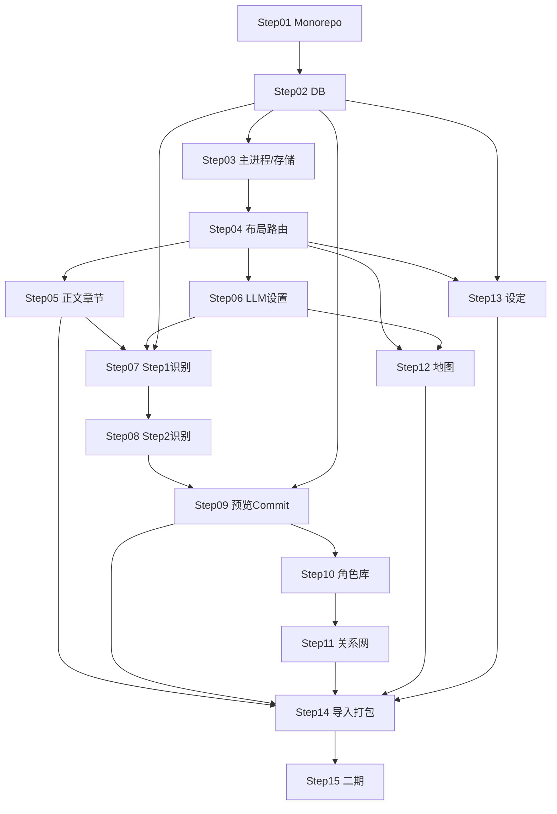

# 00 · 实施总览

## 1. 与计划说明的关系

```
md/（计划说明）          impl/（计划实施）
─────────────────       ─────────────────
是什么、为什么          怎么做、按什么顺序做
功能规格、数据模型  →    具体文件、接口、测试命令
开放问题决策            难点、风险、解法
```

实施时以 `md/` 为**权威规格**；`impl/` 为**执行手册**。若实现中发现规格矛盾，先改 `md/` 再改代码。

## 2. 技术栈（实施定稿）

| 层 | 选型 |
|----|------|
| 桌面壳 | Electron 33+ |
| 构建 | electron-vite + Vite 5 |
| 前端 | Vue 3 + TypeScript + Pinia + Vue Router |
| 样式 | Tailwind CSS 3 |
| 组件库 | Naive UI（树、对话框、表格） |
| 数据库 | better-sqlite3（主进程） |
| 核心逻辑 | `packages/core` 纯 TS，无 Electron 依赖 |
| 数据访问 | `packages/db` Repository 模式 |
| 测试 | Vitest（unit）+ Playwright（e2e 关键路径） |

## 3. 目标仓库结构（Step 01 后应达到）

```
小说创作助手-v3/
├── md/                          # 计划说明（不动）
├── impl/                        # 计划实施（本目录）
├── apps/
│   └── desktop/
│       ├── electron.vite.config.ts
│       ├── package.json
│       └── src/
│           ├── main/              # Electron 主进程
│           │   ├── index.ts
│           │   ├── ipc/           # IPC handlers
│           │   └── services/      # db, safeStorage, fs
│           ├── preload/
│           │   └── index.ts       # contextBridge API
│           └── renderer/          # Vue 应用
│               ├── App.vue
│               ├── router/
│               ├── stores/
│               ├── views/
│               ├── components/
│               └── services/      # 调 preload API
├── packages/
│   ├── core/
│   │   ├── src/
│   │   │   ├── models/            # TS 类型（对齐 md/08）
│   │   │   ├── recognition/       # Step1/2 schema, sanitize
│   │   │   ├── preview/           # buildPreviewRows, diff
│   │   │   ├── commit/            # commit 事务逻辑
│   │   │   └── map/               # 地图代码 sanitize
│   │   └── tests/
│   └── db/
│       ├── src/
│       │   ├── schema.sql
│       │   ├── migrations/
│       │   └── repositories/
│       └── tests/
├── package.json
└── pnpm-workspace.yaml
```

## 4. 步骤依赖图



## 5. 跨步实施规范

### 5.1 IPC 命名

```
db:projects:list
db:projects:create
db:chapters:save
recognition:runStep1        # 渲染进程组装后调 LLM，或主进程代理
settings:getStoragePath
settings:setStoragePath
llm:getProfiles
llm:saveApiKey              # safeStorage
```

### 5.2 不可变原则（来自 md/）

- 章节**只存** `rawText`，预览**不入库**
- **仅最新章**可 commit
- 识别**严格模式**，全部须确认
- 同名**作者裁决**，禁止自动消歧
- 地图与识别**解耦**

### 5.3 测试策略

| 层级 | 放哪 | 测什么 |
|------|------|--------|
| 纯函数 | `packages/core/tests` | diff、sanitize、proximity 校验、commit 逻辑 |
| Repository | `packages/db/tests` | CRUD、事务、迁移 |
| 组件 | `apps/desktop/tests` | 预览表、裁决弹窗 |
| E2E | `apps/desktop/e2e` | 粘贴→识别→commit 主路径 |

### 5.4 Git 提交建议

每完成一个 Step 打一次 tag 或 commit：`impl(step-0X): 简短描述`

## 6. 全局难点预判

| 难点 | 影响步骤 | 总览解法 |
|------|----------|----------|
| Electron + better-sqlite3 原生模块 | 01–03 | 主进程独占 DB；electron-rebuild |
| LLM JSON 不稳定 | 07–08 | Zod 校验 + 重试 + sanitize |
| 预览状态与章节切换 | 05、09 | Pinia 内存 Map，切换清空 |
| 最新章门禁 | 09 | `max(chapter.number)` 比较 |
| iframe 沙箱与 postMessage | 12 | sandbox 属性 + 消息协议 |
| vis-network 大书性能 | 11 | 分层 + 聚合节点 |

## 7. 参考计划文档

| 主题 | md 文档 |
|------|---------|
| 识别全流程 | `06-text-recognition-pipeline.md` |
| 识别字段与量化、同名 | `06` §10 |
| 角色模型 | `04-character-system.md` |
| 数据模型 | `08-data-model.md` |
| UI 布局 | `03-ui-layout-spec.md` |
| 地图 | `05-map-system.md` |
| 设定 | `07-settings-custom-modules.md` |
| 路线图 | `10-mvp-roadmap.md` |
