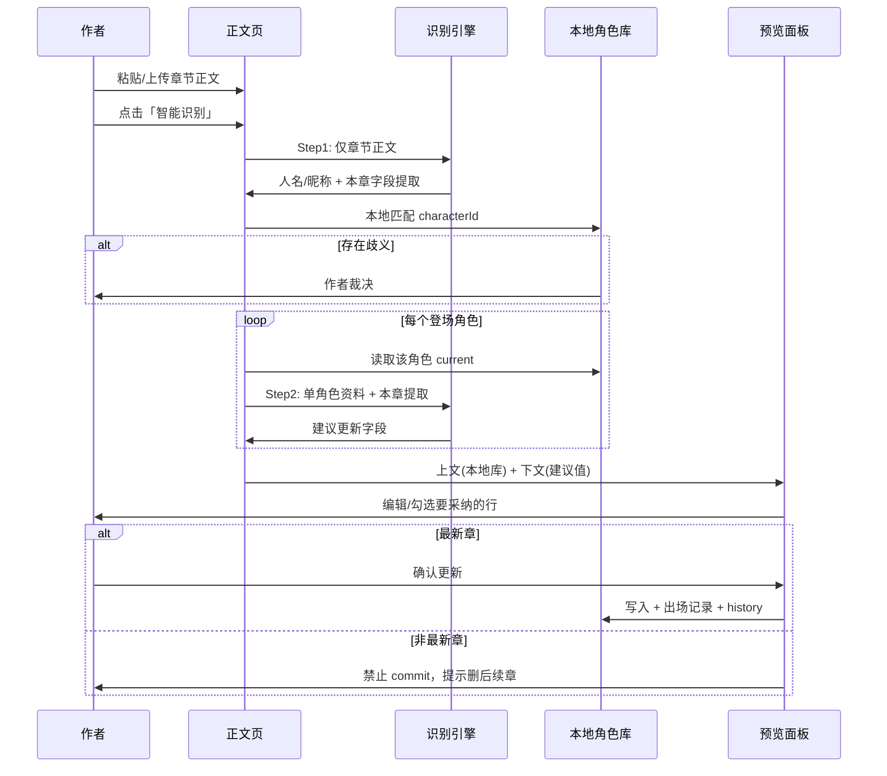

# 01 · 产品功能全景

## 1. 功能地图

```
小说创作助手 v3
├── 顶栏
│   ├── 存储目录选择（用户自选，全局）
│   └── 作品名 / 设置 / 导出
│
├── 首页（作品入口）
│   ├── 作品列表 / 新建
│   └── 进入作品 → 默认「正文」（非地图）
│
├── 全局壳层
│   ├── 最左：角色名列表 + 搜索（全书级，各页常驻可折叠）
│   └── 侧边栏：正文 | 地图 | 角色 | 设定
│
├── 正文（核心工作流）
│   ├── 左：章节切换（极简）
│   ├── 中：粘贴 / 上传正文（txt / docx / 番茄格式）
│   └── 右：识别预览（双栏 diff → 可内联编辑 → 严格确认更新）
│
├── 地图
│   ├── 左侧：世界选择 + 搜索查询
│   ├── 主区：文本 LLM 生成地图代码 → 沙箱渲染（真实地理关系）
│   └── 作者提示词驱动生成/更新（与正文识别独立）
│
├── 角色
│   ├── 球状关系网（默认单主角居中；群像可多中心）
│   ├── 点击节点 → 人物卡片 + 角色面板词条
│   └── 与角色名列表联动
│
└── 设定
    ├── 顶部：选择工具 → 添加模块
    ├── 内置四模板：大纲 / 力量体系 / 人设表 / 伏笔追踪（可空白）
    └── 下方：自定义标题 + 模块内容（富文本/清单/表格…）
```

---

## 2. 用户故事

### US-01 · 用提示词生成可交互地理地图
> 作为作者，我编写地图提示词，希望 AI 生成一张有真实地理关系（方位、邻接、远近）的可交互地图，地点可悬停突出，以便写作时有空间参照。

**验收：**
- 左侧可选择不同世界并搜索地点
- 文本 LLM 根据提示词生成 HTML/SVG 地图代码，沙箱渲染
- 地点之间有可理解的相对位置关系，非无关联图片拼贴
- 悬停区域突出，点击与左侧树联动
- 作者改提示词可重新生成

---

### US-02 · 粘贴章节并识别角色变化
> 作为作者，我把刚写的章节粘贴进来，希望系统先识别角色名和昵称并匹配角色库，再提取各角色信息，但不要直接改我的设定库。

**验收：**
- 两步识别：Step 1 **仅发正文**提取人名/昵称与本章字段 → **本地**匹配角色库 → Step 2 **按角色**发送该角色资料 + 本章提取，输出建议更新
- Step 1 **必须**识别：身份/称号、境界、所在地、势力、关系、功法/技能、法宝/装备、年龄/寿命
- **与主角关系远近：** 输出类型 + proximity 1–5（见 `06` §10.3）
- **同名裁决：** 无法确认时阻断 Step 2，交由作者选择（见 `06` §10.4）
- 预览上文=角色库已有，下文=name|value 可编辑；**不自动写入**角色库

---

### US-03 · 预览确认并更新（仅最新章）
> 作为作者，我想对比角色库已有信息与本章识别结果，逐项决定采纳哪些；且只有最新章才能更新角色卡。

**验收：**
- 预览：上文角色库已有 + 下文 name|value 列表，行级勾选
- 非最新章：可识别预览，但「确认更新」禁用
- 需改历史设定：删后续章 → 重贴 → 重新识别 commit
- commit 后更新出场章节时间线

---

### US-04 · 球状关系网浏览
> 作为作者，我想看到主角在关系网中心（群像时可多中心），配角按与主角关系远近分布在周围，点击可查看卡片与面板词条。

**验收：**
- 默认单主角居中；群像模式可切换多中心布局
- 节点距离/大小反映与主角关系量化值（识别 + 可手动调整）
- 点击弹出卡片：基础字段 + 角色面板（功法/技能、法宝/装备、年龄/寿命等词条）
- 与左侧角色名列表点击联动高亮

---

### US-05 · 全书角色名快速检索
> 作为作者，我在最左侧随时搜索角色名，跳转到该角色卡片或关系网中的节点。

**验收：**
- 支持模糊搜索、别名匹配
- 结果列表显示：境界、最近出场章节
- 窄栏设计，可折叠至图标条

---

### US-06 · 自定义设定模块
> 作为作者，有的书需要详细大纲，有的只需要世界观词条，我希望能自己添加模块类型，而不是被固定表单束缚。

**验收：**
- 顶部工具栏：添加「富文本块」「思维导图」「表格」「清单」等
- 每块有自定义标题
- 块可拖拽排序、折叠、删除
- 内置四模板：大纲、力量体系、人设表、伏笔追踪（插入后内容可空白）

---

### US-07 · 章节管理（轻量）
> 作为作者，我需要按章组织正文，但章节列表不应占太多屏幕。

**验收：**
- 左栏默认宽度 ≤ 56px（仅显示章号）或 hover 展开标题
- 支持新建、重命名、删除、拖拽排序
- 章节与识别记录关联

---

## 3. 核心工作流（Happy Path）



---

## 4. 功能优先级（MoSCoW）

### Must（MVP）
- 作品 CRUD、用户自选存储目录（顶栏）
- 正文三栏布局（章节 | 编辑 | 预览 name|value 列表）
- LLM **两步**严格模式识别 → 预览 → **仅最新章**确认更新
- 球状关系网（单主角/多中心可切换）
- 地图：世界选择 + LLM 生成地图代码（沙箱渲染）+ 作者提示词更新
- 设定页：富文本/清单 + 四内置模板
- .docx / txt / 番茄格式导入

### Could（第二期）
- 思维导图模块
- 设定冲突自动检测（境界倒退、死而复生等）
- 地图 2D 示意图
- 别名/改名追踪
- 导出设定 Bible（PDF/Markdown）
- 小程序端

### Won't（本期不做）
- 从 v2 导入
- 云端同步、账号体系
- AI 写正文 / 创作建议
- 识别自动更新地图
- 宽松模式（高置信度自动合并）
- 语音输入

---

## 5. 与竞品差异

| 产品类型 | 代表 | v3 差异点 |
|----------|------|-----------|
| 写作软件 | Scrivener、语雀 | 不做排版发布，专注设定记忆 |
| 设定 wiki | Notion、World Anvil | 识别从正文自动填充，而非纯手工建库 |
| AI 写作 | Sudowrite | 不代写，只做提取与防吃书 |
| v2 自身 | 独立主角面板 | 面板词条归入各角色卡片 + 关系网 + 可定制设定 |
