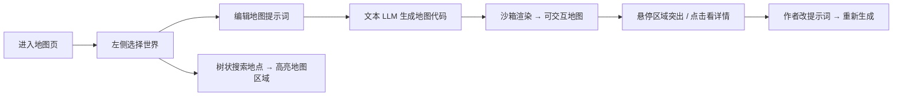

# 05 · 地图系统设计

## 1. 设计目标

- 呈现**真实地理场景感**：地点之间有**相对位置与空间关系**（东西南北、远近、邻接、山川阻隔等），不是无关联的图片拼贴
- 作者提供**提示词**，由**文本 LLM**（与识别共用 API，用户自备 Key）根据提示词**生成地图展示代码**（HTML + SVG/CSS，必要时少量内联 JS）
- 应用在**沙箱 iframe** 中直接渲染生成的代码，得到可交互地图
- 左侧**世界选择 + 树状搜索**；主区为**一整张可交互地图**（地点区域可悬停突出、点击看详情）
- **与正文识别解耦**：地图不由识别自动更新，作者单独用提示词维护

> **方案变更说明（2026-07-22）：** 由「图像 API 生成板块」改为「文本 LLM 生成地图代码」。理由：地理关系需要结构化布局，代码（尤其 SVG）比静态图更易表达方位与邻接；且无需另接图像 API。

---

## 2. 用户流程



**注意：** 识别章节正文**不会**触发地图更新（已确认 C2）。

---

## 3. 地图提示词（输入）

### 3.1 收集时机
- 新建作品向导（可选跳过）
- 地图页：世界级说明 + 可选区域级补充
- 「重新生成」：整图重新生成（保留上一版代码备份）

### 3.2 提示词应包含的信息

| 内容 | 用途 | 示例 |
|------|------|------|
| 地理格局 | 大陆/海洋/山脉整体布局 | 「东洲在西，西荒在东，中间隔万里妖山」 |
| 地点列表与关系 | 相对位置、邻接、距离感 | 「青云宗在青云山主峰，天元城在山脚平原南侧」 |
| 视觉风格 | 画风、色调 | 「水墨仙侠风，山河为主，城池为点缀」 |
| 交互需求 | 悬停/点击行为 | 「各地块悬停放大并显示地名」 |

### 3.3 建议字数
- 世界说明：200–3000 字（越具体，地理关系越准）
- 单地点补充：可在树节点 `summary` 中维护，生成时一并注入

---

## 4. 代码生成与渲染

### 4.1 生成物形态

LLM 输出**自包含的单文件 HTML**，推荐结构：

```html
<!DOCTYPE html>
<html>
<head>
  <style>/* 地图样式：区域定位、悬停突出 */</style>
</head>
<body>
  <svg viewBox="0 0 1000 800" id="world-map">
    <!-- 各地理区域为 <g> 或 <path>，带 data-place-id -->
    <g class="region" data-place-id="qingyun-sect" data-name="青云宗">...</g>
  </svg>
  <script>/* 可选：悬停、点击 postMessage 与宿主通信 */</script>
</body>
</html>
```

**约束（写入 Prompt）：**
- 必须使用 **SVG 或纯 CSS 定位** 表达地理相对位置，禁止仅用无位置关系的列表
- 每个地点区域须带 `data-place-id`（与 `MapNode.id` 对应）
- 悬停时区域**突出**（scale / stroke / shadow）
- 禁止 `fetch`、外链脚本、外链图片（或仅允许 data URI）
- 代码须可在无网络环境运行

### 4.2 宿主渲染

```
┌──────────────┬─────────────────────────────────────────────┐
│ 世界选择 ▾   │  ┌─────────────────────────────────────────┐ │
│ 🔍 搜索      │  │                                         │ │
│              │  │     [沙箱 iframe 渲染 LLM 生成的地图]     │ │
│ 🌍 东洲      │  │      青云宗 ←→ 天元城                   │ │
│  ├ 青云宗 ←  │  │           ↕ 万妖岭                      │ │
│  ├ 天元皇城  │  │                                         │ │
│ 🌍 西荒      │  └─────────────────────────────────────────┘ │
│              │  悬停：区域突出 + 浮层显示 summary            │
│ [编辑提示词] │  [重新生成地图] [查看/编辑生成的代码]         │
│ [生成地图]   │                                             │
└──────────────┴─────────────────────────────────────────────┘
```

- **iframe sandbox：** `allow-scripts` + 禁止 `allow-same-origin`（视 Electron 能力调整），阻断访问父页面
- **通信：** 生成代码内 `postMessage` 上报 `place-id`，宿主高亮左侧树节点、打开详情侧栏
- **左侧树点击：** 宿主向 iframe `postMessage` 触发对应区域高亮/滚动

### 4.3 生成策略

| 场景 | 策略 |
|------|------|
| 首次生成 | 文本 LLM 根据世界说明 + 节点列表生成整图代码 |
| 增删地点后 | 提示作者「重新生成」或「增量补丁生成」（二期） |
| 生成失败 | 保留上一版代码 + 错误信息，可重试 |
| 缓存 | 代码存本地 `map/views/{worldId}.html`，避免重复调用 |

### 4.4 安全

- 生成代码经 **sanitize**（剥离外链、危险 API）
- 仅在沙箱 iframe 执行，不注入主进程
- 作者可「查看生成的代码」并手动微调后保存（高级）

---

## 5. 数据结构

```typescript
interface MapWorld {
  id: string;
  projectId: string;
  name: string;
  description: string;          // 世界级地图提示词
  stylePreset?: string;         // 视觉风格
  generatedCode?: string;       // 最新生成的 HTML 源码
  codeGeneratedAt?: string;
  codeVersion: number;          // 每次重新生成 +1
}

interface MapNode {
  id: string;                   // 对应 SVG data-place-id
  worldId: string;
  parentId: string | null;
  name: string;
  type: 'continent' | 'country' | 'region' | 'city' | 'sect' | 'building' | 'wilderness' | 'other';
  summary: string;
  tags: string[];
  // 地理关系（可手动维护，辅助 LLM 生成）
  geo?: {
    relativePosition?: string;  // 如「青云山东北侧」
    neighbors?: string[];       // 邻接地点 id
    distanceHint?: string;      // 如「距天元城三日路程」
  };
  source: 'ai_generated' | 'manual';
}
```

---

## 6. 树状导航（辅助）

- 左侧树与地图**双向联动**：树选节点 → 地图高亮；地图点击区域 → 树滚动定位
- 支持拖拽调整父子关系、手动添加节点
- 树结构可在首次生成时由 LLM 从世界说明抽取，作者再编辑

---

## 7. 与正文识别的关系

**已确认：不联动（C2）**

| 能力 | MVP |
|------|-----|
| 识别提取地点写入地图 | ❌ |
| 角色所在地自动挂 mapNodeId | ❌（角色 location 为自由文本） |
| 作者手动维护地图节点 | ✓ |
| 作者提示词 → LLM 生成地图代码 | ✓ |

---

## 8. 数据版本与再生成

| 操作 | 行为 |
|------|------|
| 首次生成世界 | 抽取节点树 + 生成首版地图代码 |
| 修改提示词后重新生成 | 新版本代码，旧版备份为 `generatedCode.v{n}` |
| 导出 | HTML 文件 + JSON 节点树 + Markdown 大纲 |

---

## 9. 边界情况

- **地图说明为空**：空白树 + 引导撰写说明
- **生成代码渲染报错**：显示错误 + 提供代码编辑入口
- **奇幻室内场景**（「系统空间」）：`type: other`，可在同一张图上作为独立「秘境」区块
- **无 LLM API Key**：树状导航仍可用，地图区显示配置引导

---

## 10. MVP 范围

- ✓ 多世界选择 + 左侧树状导航 + 搜索
- ✓ 地图提示词编辑 + 文本 LLM 生成 HTML/SVG 地图代码
- ✓ 沙箱 iframe 渲染 + 区域悬停突出 + 树图联动
- ✓ 手动增删改地图节点与 geo 关系字段
- ✓ 生成代码本地缓存 + 查看/编辑代码
- ○ 增量补丁生成（地点变更后局部更新，第二期）
- ○ 识别自动补充地图（不做）
