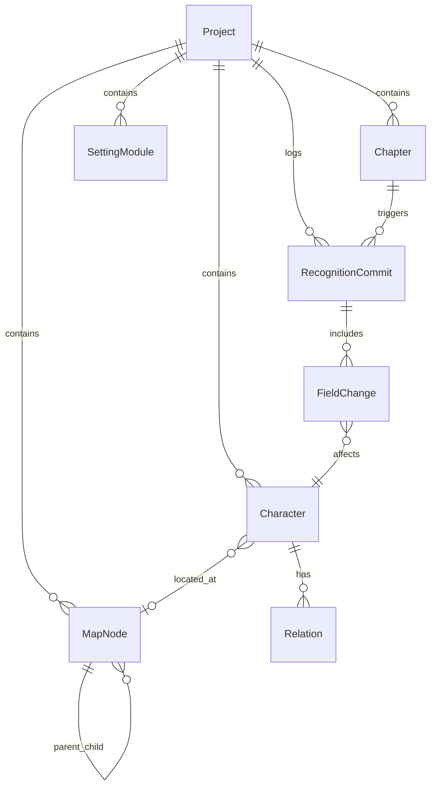

# 08 · 数据模型与存储

## 1. 实体关系图



---

## 2. 核心实体

### 2.1 Project（作品）

```typescript
interface Project {
  id: string;
  title: string;
  protagonistId?: string;
  networkMode: 'single' | 'ensemble';  // 单主角 / 群像多中心
  genre: 'generic';                    // 通用题材
  createdAt: string;
  updatedAt: string;
  schemaVersion: number;
}
```

### 2.2 Chapter（章节）

```typescript
interface Chapter {
  id: string;
  projectId: string;
  number: number;
  title: string;
  rawText: string;              // 每章仅持久化正文
  wordCount: number;
  lastCommittedAt?: string;     // 该章最后一次成功 commit 的时间
  createdAt: string;
  updatedAt: string;
}
```

> **不存储：** `recognitionStatus`、预览结果。预览仅内存暂存（见 `06-text-recognition-pipeline.md`）。

### 2.3 预览暂存（内存 only，不入库）

```typescript
interface RecognitionPreview {
  chapterId: string;
  textHash: string;
  step1: Step1Result;
  step2?: Step2Result;          // Step 1 歧义清完后才有
  isLatestChapter: boolean;     // 控制 commit 按钮
  generatedAt: string;
}
```

- 仅存**当前会话内存**（Pinia store），切换章节或关闭应用即清除
- **不写入** SQLite / 章节 JSON / localStorage

---

## 3. 文件存储结构（本地）

**存储根目录由用户在顶栏自选**（已确认 E3），默认建议：

```
{用户选定目录}/
├── projects/
│   └── {projectId}/
│       ├── project.json
│       ├── chapters/
│       ├── characters.json      // 含 panel 词条
│       ├── map/
│       │   ├── worlds.json
│       │   └── views/           // LLM 生成的地图 HTML 缓存
│           └── {worldId}.html
│       ├── settings/
│       └── commits/
├── user-preferences.json
└── llm-profiles.json            // 文本 LLM（识别 + 地图代码生成共用）
```

**或使用 SQLite 单文件**（推荐）：

```
{用户选定目录}/novel-assistant.db
```

---

## 4. SQLite vs JSON 文件

| 维度 | JSON 文件 | SQLite |
|------|-----------|--------|
| 实现难度 | 低 | 中 |
| 查询（角色搜索） | 需全量加载 | 索引查询 |
| 事务/一致性 | 弱 | 强 |
| 备份 | 复制文件夹 | 单文件 |
| 与 v2 延续 | v2 偏 JSON state | 可全新 |

**建议：MVP 用 SQLite（better-sqlite3 或 sql.js）**

---

## 5. 版本与迁移

- `schemaVersion` 递增
- 启动时检测迁移脚本
- 导出格式：`novel-v3-export.zip`（含 JSON 人类可读 + db）

---

## 6. 索引设计（若 SQLite）

```sql
CREATE INDEX idx_character_name ON characters(project_id, name);
CREATE INDEX idx_character_aliases ON character_aliases(alias);
CREATE INDEX idx_chapter_project ON chapters(project_id, number);
CREATE INDEX idx_character_appearances ON character_appearances(character_id, chapter_number);
```

---

## 7. 备份与导出

| 格式 | 用途 |
|------|------|
| `.nav3` zip | 完整备份 |
| Markdown | 设定 Bible 导出 |
| JSON | 开发者/迁移 |
| CSV | 角色表导出 |

---

## 8. 隐私与 LLM

- 正文识别：Step 1 仅发送**当前章节正文**；Step 2 按登场角色逐人发送该角色 current 字段 + 本章提取（已确认 E2，**禁止全书快照**）
- 地图代码生成：单独发送地图提示词 + 节点列表，不发送章节正文；**共用文本 LLM**
- API Key 存系统密钥链（Electron `safeStorage`）

---

## 9. 从 v2 迁移

**已确认：不需要。** v3 为完全独立新项目，不提供 v2 导入工具。
